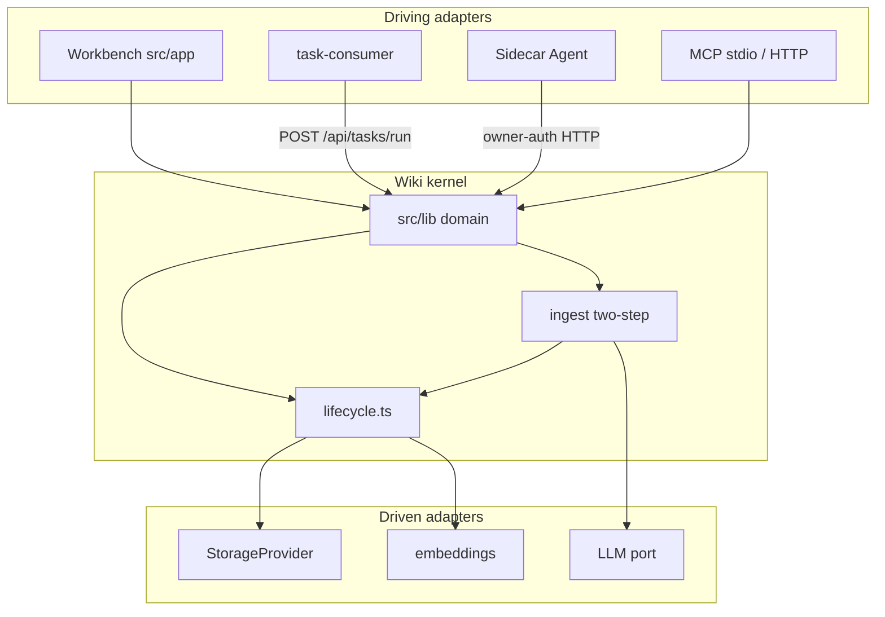
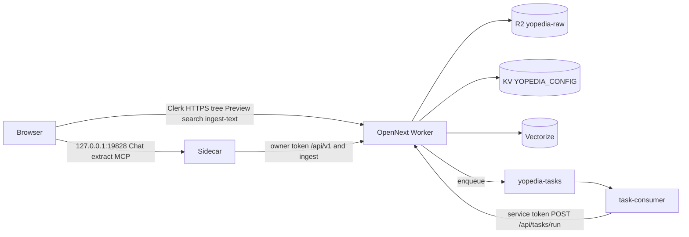
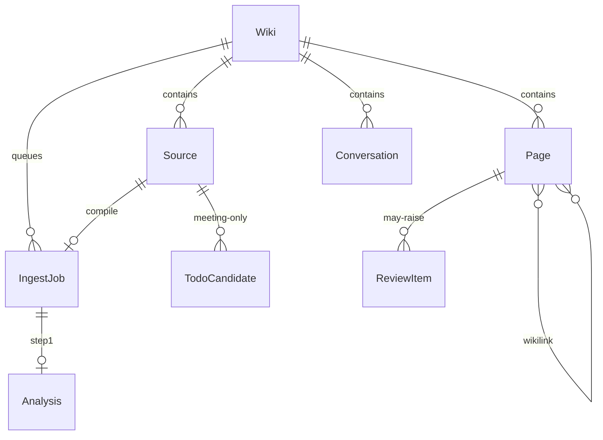

# Architecture Spine — work-wiki

## Design Paradigm

**Hexagonal (ports and adapters) across two runtimes.**

1. **Wiki kernel** — OpenNext on Cloudflare Workers. Application + domain live in `src/lib`. Driving adapters: Workbench (`src/app`), cloud `/api/v1` + `/api/mcp`, queue consumer HTTP. Driven adapters: `StorageProvider` (R2 in prod, filesystem in local `next dev`), LLM, embeddings.
2. **Agent sidecar** — separate process. Owns Chat Agent (Rust), document extractors, approved shell, Skills scan, `agent-workspace/`, loopback `127.0.0.1:19828`, and MCP wrapping that loopback. Drives the kernel only over owner-auth HTTP. Never imports Next, Clerk, or `src/lib`.

HTTP is the anti-corruption boundary. The sidecar is not a second wiki.

## Invariants & Rules

### AD-1 — Two-runtime split [ADOPTED]

- **Binds:** FR-36, FR-60, FR-65, FR-71, FR-76–79; Chat, extract, shell, Skills, Workbench
- **Prevents:** Shell, binary extract, or the Chat Agent tool loop running in the Cloudflare isolate or in the browser
- **Rule:** Workbench UI and wiki data plane stay on OpenNext Workers. Agent, extractors, shell, Skills scan, `agent-workspace/`, and the loopback API run on a **local** sidecar. No dedicated remote Agent host in v1. No `child_process` / general shell in the Worker.

### AD-2 — Kernel store is the sole system of record [ADOPTED]

- **Binds:** Pages, Sources, indexes, embeddings, Review, Todos, Conversations, Settings; sidecar disk
- **Prevents:** A local markdown vault that diverges from R2; sidecar treating `agent-workspace/` as the wiki
- **Rule:** Canonical bytes live behind `getStorage()` — R2 + KV in production; filesystem `StorageProvider` is local-dev only. Sidecar disk is extract temp and `agent-workspace/` only. Sidecar wiki reads/writes go through owner-auth kernel HTTP (`/api/v1` or ingest/lifecycle routes), not a parallel tree.

### AD-3 — Single Page/Source write path [ADOPTED]

- **Binds:** Ingest, Save to Wiki, lint fix, import, delete, MCP writes, sidecar-originated commits
- **Prevents:** Parallel writers that skip index/log/embedding/backlink side effects (the `.yoyo/learnings.md` drift)
- **Rule:** Page create/update/delete goes through `writeWikiPageWithSideEffects` / `deleteWikiPage` in `src/lib/lifecycle.ts`. Source bytes go through `saveRawSource` / `saveRawSourceFor` (immutable). New entry points call those functions (or the HTTP that already does). Do not add a second markdown or raw-source writer.

### AD-4 — Ingest compile stays in the kernel [ADOPTED]

- **Binds:** FR-9, FR-10, FR-39; `src/lib/ingest.ts`; Queues
- **Prevents:** A second compile LLM in the sidecar that writes Pages without Analysis→Generation or without `lifecycle.ts`
- **Rule:** Two sequential LLM calls (Analysis, then Generation) run in the TS kernel once extracted text is in the store. Skip cache is **SHA256** of Source bytes (replace the fork's FNV-1a). Analysis is a kernel-owned JSON artifact stored with the ingest job via `getStorage()`; Generation reads that artifact and must not re-pay Analysis on a Generation-only retry. Sidecar extracts binaries to text and does not compile wiki Pages. Today's single-shot `ingest.ts` must become this two-step pipeline — not a Rust rewrite of compile.

### AD-5 — Chat attaches at the browser; extract may be claimed [ADOPTED]

- **Binds:** FR-60, FR-71, FR-77; Workbench Chat mode; Intake of binaries
- **Prevents:** Workbench server routes that try to reach localhost; a browser-side tool loop; using `src/lib/query.ts` as v1 Chat; office extract inside the isolate
- **Rule:** The Worker cannot reach `127.0.0.1`. Workbench **Chat is a rail icon** (UX lock), not an always-on center column. Chat streams from the browser to sidecar loopback `POST /api/v1/projects/:wikiId/chat`. SSE events are exactly `meta`, `agent`, `done`, `cancelled`, `error`. JSON is default; Workbench sends `stream: true` or `Accept: text/event-stream`. `done` is the aggregate — clients must not also commit deltas as a second message. Existing `src/lib/query.ts` / `/api/query` is **not** v1 Chat (404 or unused). Binary extract is AD-16 + AD-24. Same-machine vs phone is AD-17.

### AD-6 — Dual `/api/v1` surfaces, one contract [ADOPTED]

- **Binds:** FR-36, FR-76–78; Settings → API + MCP; llm-wiki skill
- **Prevents:** Binding the nashsu loopback on `0.0.0.0`; implementing Chat twice (Worker agent vs sidecar agent); cloud façade drifting from loopback route shapes
- **Rule:** Sidecar binds `127.0.0.1:19828` only. Cloud `/api/v1` is the same route shapes on the OpenNext app behind Clerk or owner token — not that loopback port. Implementers: AD-22. Cloud `POST /api/v1/projects/:wikiId/chat` and any `/api/v1/chat` alias return **503** `sidecar_required`. Chat runs only on the loopback sidecar.

### AD-7 — Runtime identifiers stay `yopedia` [ADOPTED]

- **Binds:** all storage, auth, MCP, env, wrangler, localStorage
- **Prevents:** A display rebrand that renames bindings and orphans R2/KV/Queue data
- **Rule:** `DEFAULT_TENANT`, `BASE_AGENT_OWNER`, `AUTOMATION_ACTORS`, MCP server name, localStorage keys, `YOPEDIA_*` env/secrets, and every resource name in both `wrangler.jsonc` files stay `yopedia`. User-visible copy is work-wiki.

### AD-8 — Private-by-default auth [ADOPTED]

- **Binds:** FR-1; Clerk; MCP HTTP; task-consumer; `/api/v1`
- **Prevents:** Unauthenticated commons reads (current `src/lib/mcp-http.ts` fork leftover); public lab as a v1 surface
- **Rule:** Humans authenticate with Clerk. Agents and the task-consumer use a bearer owner/service token. v1 MCP and HTTP reads require that auth. Stock llm-wiki skill stays read-only except rescan. Write MCP is owner-auth only and is not part of the stock skill. Commons product surface is AD-21.

### AD-9 — Serial ingest per Wiki; Chat may overlap [ADOPTED]

- **Binds:** FR-39, Activity panel, Chat
- **Prevents:** Concurrent Analysis/Generation on the same Wiki; Chat blocked on ingest or ingest blocked on Chat
- **Rule:** One Source's compile LLM work at a time per Wiki. Queue is durable (Cloudflare Queues). Failed tasks retry at most 3 times then stay failed for manual retry. Chat turns may run during ingest.

### AD-10 — SCHEMA.md is executable [ADOPTED]

- **Binds:** ingest, Chat, lint; `src/lib/schema.ts`
- **Prevents:** Treating SCHEMA.md as docs-only while two builders bake different conventions into prompts
- **Rule:** The Page conventions section is loaded into LLM prompts at ingest/chat/lint time. Editing SCHEMA.md changes production behavior without a deploy. Prompt authors read it; they do not fork a second copy of conventions into code.

### AD-11 — dataVersion after kernel commits [ADOPTED]

- **Binds:** FR-74; Workbench trees, Preview, Search
- **Prevents:** UI that stays stale after ingest, Save to Wiki, or sidecar-originated commits
- **Rule:** Every successful `lifecycle.ts` write/delete bumps `dataVersion`, a **monotonic integer** in `YOPEDIA_CONFIG` (KV; fs equivalent locally). Sidecar commits must use the kernel write path so the bump happens. Workbench refetches when the version changes.

### AD-12 — Embeddings are optional and model-tagged [ADOPTED]

- **Binds:** FR-52; Vectorize; ingest; search
- **Prevents:** Always-on Vectorize as a hard ingest dependency; mixing embedding models in one index without a miss
- **Rule:** Vector search is **off by default** (the fork's always-on Workers AI / Vectorize path must change). Ingest succeeds with embeddings off. Stored vectors are tagged with the embedding model; a model mismatch is a cache miss and search falls back to tokenized retrieval. ANN on this stack is Cloudflare Vectorize, not LanceDB.

### AD-13 — Task consumer is a thin dispatcher [ADOPTED]

- **Binds:** `workers/task-consumer/`; `yopedia-tasks`; `/api/tasks/run`
- **Prevents:** Importing `src/lib` (and thus Clerk/Next/OpenNext context) into the standalone consumer
- **Rule:** The consumer drains `yopedia-tasks` and POSTs each message to **this fork's** OpenNext app `/api/tasks/run` with `YOPEDIA_SERVICE_TOKEN`. Do not leave `YOPEDIA_URL` pointing at `yopedia.yolog.dev`. 2xx ack, 4xx poison-ack, 5xx retry. Ingest, reconcile, and any daily maintenance cron execute in the kernel via this dispatcher, not in the consumer.

### AD-14 — Graph viz is sigma + graphology [ADOPTED]

- **Binds:** FR-19, FR-45–47, FR-49–50; Workbench Graph mode
- **Prevents:** vis-network / cytoscape / custom canvas as a second graph renderer
- **Rule:** Workbench Graph mode renders with `sigma` + `graphology` + `graphology-layout-forceatlas2` + `graphology-communities-louvain` (replace the fork's custom canvas). Kernel computes 4-signal Relevance and Louvain and serves them to the Workbench. Loopback `GET .../graph` for the Agent Skill may be the wikilink graph; it is not a second viz library. Cache node positions after layout so Ingest does not re-scatter the view. Cohesion warn below 0.15 and the 12-color Community palette stay as in UX DESIGN.md.

### AD-15 — Bump Next and OpenNext together before next prod deploy [ADOPTED]

- **Binds:** OpenNext Worker, `package.json`
- **Prevents:** Staying on Next 15.5.18 / adapter 1.19.10 (below current peer floor) or jumping to Next 16 while the other unit stays on 15.5
- **Rule:** Before the next production `wrangler` deploy, bump `next` to **15.5.23** (floor `>=15.5.21 <16`) and `@opennextjs/cloudflare` to **1.20.2** in the same change. Bump `react` / `react-dom` to **19.1.4** with that change (Clerk 7.4.2 peer). Do not ignore the peer gap until it breaks. Do not move to Next 16 in v1.

### AD-16 — Sidecar extract crate set [ADOPTED]

- **Binds:** FR-71, FR-72; sidecar; Intake of office/PDF
- **Prevents:** unpdf / JS office parsers in the Worker as the v1 extract path; a second crate set in a TS sidecar
- **Rule:** Binary extract runs in the Rust sidecar: **pdf-extract** (PDF, cached), **docx-rs** (DOCX), **calamine** (XLSX/XLS/ODS), PPTX via ZIP+XML, EPUB/MOBI in the same process. Web clips stay in the kernel (`@mozilla/readability` + `linkedom` + existing `htmlToMarkdown` — not a Turndown package). MinerU is optional and off by default (AD-19). How binaries reach the sidecar is AD-24.

### AD-17 — v1 device split [ADOPTED]

- **Binds:** FR-36, FR-60; phone vs desktop; Chat, extract, MCP
- **Prevents:** Shipping Chat/extract as if the Cloudflare origin can reach the sidecar; treating phone as a full Workbench
- **Rule:** Any Clerk-authenticated browser may use tree, Preview, and search. Chat, binary extract, loopback `:19828`, shell, and Skills require the sidecar on the **same machine** as the browser. Without the sidecar, Chat mode is unavailable — do not invent a different IA. UX stacked Chat+Todos below ~900px still applies when the sidecar is present. Phone is browse-only in v1.

### AD-18 — Deep Research default is Tavily [ADOPTED]

- **Binds:** FR-24, FR-67; Settings
- **Prevents:** One epic defaulting SearXNG (self-host) and another defaulting SerpApi
- **Rule:** Out of the box the active Deep Research provider is **Tavily**. SerpApi and SearXNG remain selectable in Settings. One provider is active at a time; unused keys may be stored. Deep Research uses its **own** queue, max **3** concurrent tasks, separate from serial Ingest (FR-70).

### AD-19 — MinerU default is off [ADOPTED]

- **Binds:** FR-71; Settings; PDF Intake
- **Prevents:** Defaulting MinerU Cloud (PDFs leave the machine) or Pipeline as the job default
- **Rule:** MinerU is **off**. Built-in pdf-extract still runs. If enabled, the first mode is **Local API**, not Cloud.

### AD-20 — Todos persist until owner delete [ADOPTED]

- **Binds:** Todo Candidates, Open, Done; rejected Candidates
- **Prevents:** A 90-day TTL in one epic and keep-forever in another
- **Rule:** Rejected Candidates and completed Todos persist until the owner deletes them. No automatic expiry.

### AD-21 — Commons product surface is 404 / no-op [ADOPTED]

- **Binds:** FR-1 cut list; MCP; `syncCommonsForPage`
- **Prevents:** Leaving public commons/browse/waitlist/billing/clone-to-private/talk live; a cleanup epic that deletes modules while another still calls them
- **Rule:** Those routes **404**. MCP publish-to-commons is not in the v1 tool list. `syncCommonsForPage` is a no-op. Module files may remain if they have zero reachable callers. Unauthenticated MCP reads and public GET wiki routes must go away with this cut.

### AD-22 — `/api/v1` ownership [ADOPTED]

- **Binds:** FR-36, FR-76–78; sidecar loopback; cloud façade; Agent Skill
- **Prevents:** Sidecar and kernel each implementing search/graph/reviews; Chat URL drift; skill talking to a different contract than Workbench
- **Rule:** Kernel is the only implementation of wiki read, search, graph, reviews, rescan, projects list, and file content. Sidecar implements Chat, extract, shell/Skills, loopback `/health`, and MCP wrapping loopback. Every other loopback `/api/v1` route is a **reverse-proxy** to the kernel with identical request/response bodies (FR-76 field names). `:wikiId` is the kernel Wiki UUID; `current` is the operator's active Wiki; a filesystem path is a **loopback-only** alias. Cloud never accepts a filesystem path. Stock skill talks to loopback only.

### AD-23 — Kernel owns durable Workbench state [ADOPTED]

- **Binds:** Conversations, Settings (including API keys and Chat vs Ingest models), Review items, Todos, dismissed Insights, project config
- **Prevents:** A sidecar SQLite/JSON store that diverges from R2/KV; browser-only Settings
- **Rule:** Those records persist in the kernel store (server-durable). Sidecar may cache in memory for a turn. Panel widths may persist in the browser. Skills scan reads folders; Skill enablement is kernel Settings.

### AD-24 — Extract jobs are kernel-queued; sidecar claims them [ADOPTED]

- **Binds:** FR-41, FR-71; email, Plaud, API/MCP uploads, Workbench drop
- **Prevents:** Browser-only extract that drops email/Plaud/API binaries sitting in R2; Worker trying to parse office files
- **Rule:** Raw bytes are stored in the kernel first (`raw/sources/`). If extract is required, the kernel enqueues an extract job. The sidecar **claims** pending extract jobs, writes extracted text back through kernel HTTP, then kernel ingest (AD-4) runs. Browser-local drop may send bytes to the sidecar, which still POSTs raw + text into the kernel — no second vault. Plain text/markdown/URL Intake may skip extract.



Sidecar and Workbench UI may not import each other's internals. Kernel domain may not import `src/app`. Consumer may not import `src/lib`.

## Consistency Conventions

| Concern | Convention |
| --- | --- |
| Display vs runtime names | Copy and titles: work-wiki. Bindings, tenants, MCP server, env: yopedia (AD-7) |
| Page files | `wiki/<slug>.md` with typed `Frontmatter` in `src/lib`. `sources` is a YAML list. Wikilinks are `[[slug]]`. Sources immutable under `raw/sources/` |
| IDs | URL-safe slugs via `validateSlug`. Wiki id is a kernel UUID; `current` = active Wiki. ISO-8601 timestamps |
| Errors | JSON body with an `error` string; HTTP status carries class (4xx caller, 5xx retry). Cloud Chat: 503 `sidecar_required` |
| Auth | Clerk session for browser. Bearer owner token for `/api/v1`. Loopback/skill also accepts `LLM_WIKI_API_TOKEN` (nashsu skill). `YOPEDIA_SERVICE_TOKEN` for task-consumer |
| Mutation | Pages/Sources only through AD-3. Conversations/Settings/Review/Todos through kernel (AD-23) |
| Ingest jobs | SHA256 skip; Analysis JSON stored with the job; Activity shows Analysis then Generation |
| Chat SSE | Events `meta`, `agent`, `done`, `cancelled`, `error` (AD-5) |
| Meeting Todos | Extract iff Plaud-origin or user-marked meeting (FR-26) |
| Preview | View-first; markdown edit is confirm-gated; no WYSIWYG (UX EXPERIENCE.md) |
| dataVersion | Monotonic integer in `YOPEDIA_CONFIG` (AD-11) |
| Logging | Existing `src/lib/logger.ts` in the kernel. Sidecar logs locally; do not require Worker tail for Chat |
| Config | Wrangler bindings `YOPEDIA_BUCKET`, `YOPEDIA_CONFIG`, `YOPEDIA_VECTORIZE` / `VECTORIZE`, `AI`, `TASK_QUEUE`. Do not rename |
| Language | UI and LLM Generation English-only |
| Graph colors | Categorical (UX DESIGN.md); not chrome tokens |
| Deep Research | Default provider Tavily (AD-18); confirm before run |
| MinerU | Off; Local API if enabled (AD-19) |
| Todos | No TTL; owner delete only (AD-20) |
| Sidecar package | `sidecar/` at repo root — not under `workers/` |

## Stack

Seed — verified 2026-08-12 from `package.json`, npm registry, crates.io, and Context7. Code owns versions once they move. AD-15 is the Next/OpenNext production target.

| Name | Version |
| --- | --- |
| next (repo today) | 15.5.18 |
| next (required before next prod deploy) | 15.5.23 (>=15.5.21 <16) |
| react / react-dom (repo today) | 19.1.0 |
| react / react-dom (with Next bump) | 19.1.4 |
| typescript | ^5 |
| @clerk/nextjs | ^7.4.2 |
| ai (Vercel AI SDK) | ^6.0.146 |
| @ai-sdk/anthropic | ^3.0.66 |
| @ai-sdk/openai | ^3.0.50 |
| @ai-sdk/google | ^3.0.60 |
| @opennextjs/cloudflare (repo today) | ^1.19.10 |
| @opennextjs/cloudflare (required) | 1.20.2 |
| wrangler | ^4.92.0 |
| vitest | ^3 |
| tailwindcss | ^4 |
| zod | ^4.4.2 |
| @modelcontextprotocol/sdk | ^1.29.0 |
| sigma | 3.0.3 |
| graphology | 0.26.0 |
| graphology-layout-forceatlas2 | 0.10.1 |
| graphology-communities-louvain | 2.0.2 |
| pdf-extract (Rust crate) | 0.12.0 |
| docx-rs (Rust crate) | 0.4.22 |
| calamine (Rust crate) | 0.36.1 |
| @mozilla/readability | ^0.6.0 |
| Node.js (Next 15.5.23 engines) | 18.18 or 19.8 or >=20.0.0 |
| Cloudflare Workers compatibility_date | 2025-01-01 |
| Cloudflare Queues | yopedia-tasks / yopedia-tasks-dlq |
| R2 bucket | yopedia-raw (binding YOPEDIA_BUCKET) |
| KV | YOPEDIA_CONFIG |
| Vectorize | yopedia-embeddings |

OpenNext Cloudflare 1.20.2 (Context7) peers Next.js `>=15.5.21 <16` or `>=16.2.11`. v1 stays on 15.5.x (AD-15).

## Structural Seed

```text
work-wiki/
  src/app/                 Workbench UI + cloud API façade
  src/lib/                 wiki kernel (domain + ports)
  src/lib/lifecycle.ts     sole Page/Source mutation
  src/lib/ingest.ts        two-step compile (today: single-shot; must change)
  src/lib/storage/         R2 | filesystem adapters
  src/lib/schema.ts        loads SCHEMA.md into prompts
  src/mcp.ts               stdio MCP (owner-auth; no public reads)
  src/lib/mcp-http.ts      HTTP MCP dispatch (same handlers)
  workers/task-consumer/   thin queue dispatcher
  sidecar/                 Rust Agent + extract + :19828 (not under workers/)
  wrangler.jsonc           yopedia bindings — do not rename
  workers/task-consumer/wrangler.jsonc
  SCHEMA.md                executable conventions
```



Production deploy is manual `wrangler` (fork GitHub deploy workflows are inert). Local: `next dev` + filesystem storage + sidecar on 19828. Sidecar's kernel origin is the Workbench HTTPS origin (local Next or this fork's Worker) — not `yopedia.yolog.dev`.



## Capability → Architecture Map

| Capability / Area | Lives in | Governed by |
| --- | --- | --- |
| Workbench shell (rail, tree, Preview) | `src/app` | AD-1, UX DESIGN.md, EXPERIENCE.md |
| Intake (upload, folder, email, Plaud) | Workbench + kernel store + sidecar extract | AD-2, AD-5, AD-9, AD-16, AD-24 |
| Two-step Ingest | `src/lib/ingest.ts` + Queues + `lifecycle.ts` | AD-3, AD-4, AD-9, AD-10 |
| Chat Agent | sidecar; browser → loopback | AD-1, AD-5, AD-6, AD-17, AD-22 |
| Cloud `/api/v1` façade | `src/app/api` | AD-6, AD-8, AD-22 |
| Loopback `/api/v1` | sidecar `:19828` (Chat + proxy) | AD-6, AD-22 |
| Durable Conversations / Settings / Review / Todos | kernel store | AD-23 |
| MCP | sidecar wraps loopback; cloud `/api/mcp` owner-auth | AD-3, AD-8 |
| Search (tokenized + optional ANN) | `src/lib` | AD-12 |
| Graph API + viz | kernel API; Workbench `sigma`/`graphology` | AD-14 |
| Lint | `src/lib` | AD-10, AD-3 |
| Review + Todos | kernel persist + Workbench | AD-3, AD-8, AD-20 |
| Deep Research | kernel + Settings provider | AD-18 |
| Skills + shell + agent-workspace | sidecar | AD-1, AD-17 |
| Task queue | `workers/task-consumer` + kernel `/api/tasks/run` | AD-13 |
| Commons / public lab leftover | 404 / no-op | AD-21 |
